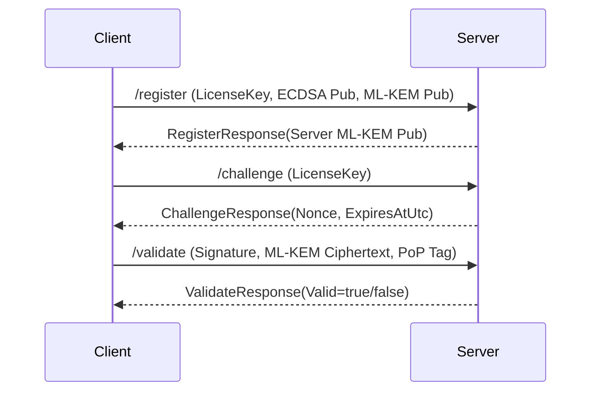

SecureLicenseCore - Hybrid License System (ECDSA + ML-KEM)

Overview
- Purpose: Hybrid license challenge-response using ECDSA (classic) + ML-KEM (post-quantum KEM)
- Client: Generates ECDSA P-256 + ML-KEM-768, registers both public keys, then validates with ECDSA signature + ML-KEM ciphertext + PoP tag
- Server: Stores client keys, generates its own ML-KEM-768 keypair per license, decapsulates ciphertext, verifies PoP, and verifies ECDSA

What was created/changed (current state)
1) DTOs (shared contract)
   File: src/LicenseCore.Shared/DTOs/SharedModels.cs
   - RegisterRequest now carries 2 public keys:
     - EcdsaPublicKeyBase64 (SPKI DER)
     - MlKemPublicKeyBase64 (raw ML-KEM public key bytes)
   - RegisterResponse now returns:
     - ServerMlKemPublicKeyBase64 (raw ML-KEM public key bytes)
   - ValidateRequest carries:
     - SignatureBase64 (ECDSA DER signature)
     - MlKemCiphertextBase64 (KEM ciphertext)
     - MlKemProofOfPossessionBase64 (HMAC/tag for key confirmation)

2) Server behavior
   File: src/LicenseCore.Server/Program.cs
   - /register:
     - Validates client keys
     - Generates a fresh ML-KEM-768 keypair for the server side
     - Stores server ML-KEM private key per license
     - Returns server ML-KEM public key in RegisterResponse
   - /challenge:
     - Generates 32-byte nonce with expiry
   - /validate:
     - Verifies ECDSA signature with explicit DER format (Rfc3279DerSequence)
     - Decapsulates ML-KEM ciphertext with stored server private key
     - Verifies PoP tag using FixedTimeEquals
     - Authorizes only if ECDSA + PQ checks both succeed

3) Client behavior
   File: src/TestClient/Program.cs
   - Uses server URL from LICENSE_SERVER_URL (default: http://localhost:5108)
   - Registers keys, reads server ML-KEM public key from response
   - Encapsulates to server ML-KEM public key
   - Builds PoP tag as HMAC(sharedSecret, "Challenge{NonceBase64}{LicenseKey}")
   - Validates with ECDSA signature + ciphertext + PoP

4) Hybrid key provider
   File: src/LicenseCore/HybridKeyProvider.cs
   - Generates ECDSA P-256 and ML-KEM-768
   - Encapsulates with randomness (SecureRandom) for ML-KEM
   - ECDSA signatures are DER (Rfc3279DerSequence)

Crypto formats (current)
- EcdsaPublicKeyBase64: Base64(SPKI DER)
- MlKemPublicKeyBase64: Base64(raw ML-KEM public key bytes)
- ServerMlKemPublicKeyBase64: Base64(raw ML-KEM public key bytes)
- MlKemCiphertextBase64: Base64(raw ciphertext bytes)
- MlKemProofOfPossessionBase64: Base64(HMAC/tag)
- ECDSA signature: DER sequence (Rfc3279DerSequence)

Run & test (PowerShell)
1) Start server
   dotnet run --project .\src\LicenseCore.Server

2) Run client once
   dotnet run --project .\src\TestClient

3) Run client 10x serial
   for ($i=1; $i -le 10; $i++) { dotnet run --project .\src\TestClient; Start-Sleep -Milliseconds 300 }

4) Run client 10x parallel (jobs)
   $root = "C:\Users\Legalized\Desktop\CAS"
   $jobs = 1..10 | ForEach-Object { Start-Job -ArgumentList $root -ScriptBlock { param($r) dotnet run --project (Join-Path $r "src\TestClient") } }
   $jobs | Wait-Job
   $jobs | Receive-Job
   $jobs | Remove-Job

Comparison: original vs current
- Original idea: Only client ML-KEM public key + ciphertext in Validate
- Current: Adds explicit PoP tag so server can confirm sharedSecret possession
- Original: No server ML-KEM public key delivery to client
- Current: /register returns ServerMlKemPublicKeyBase64 so client encapsulates correctly
- ECDSA verify: now explicitly uses DER format to avoid signature mismatch
- Breaking change: RegisterRequest renamed/expanded; clients must update

Notes
- Server stores ML-KEM private key per license (dev-friendly). For production, move to HSM/KMS.
- Warnings remain about Windows-only APIs in LicenseCore/LicenseSystem.cs (not related to PQ flow).

Security Note (Technical)
Goal
- Hybrid challenge-response for license validation using ECDSA P-256 + ML-KEM-768

Crypto Building Blocks
- ECDSA P-256: signature over LicenseKey + Nonce (DER, Rfc3279DerSequence)
- ML-KEM-768: KEM encapsulation from client to server public key
- PoP/Key Confirmation: HMAC tag over transcript using sharedSecret from decapsulation

Protocol Flow (simplified)
1) Register
   - Client sends EcdsaPublicKeyBase64 (SPKI DER) + MlKemPublicKeyBase64 (raw)
   - Server generates its ML-KEM keypair and returns ServerMlKemPublicKeyBase64
2) Challenge
   - Server issues nonce + expiry
3) Validate
   - Client signs LicenseKey.NonceBase64 with ECDSA
   - Client encapsulates ML-KEM to server public key
   - Client sends ciphertext + PoP tag (HMAC over transcript)
   - Server verifies ECDSA and PoP; both must succeed

Security Properties
- Integrity & authenticity via ECDSA
- Post-quantum resilience via ML-KEM
- Proof-of-Possession via HMAC tag
- Hybrid enforcement possible (no downgrade if required)

Implementation Rules
- Explicit ECDSA DER verify (Rfc3279DerSequence)
- ML-KEM encapsulation MUST use randomness
- PoP compare with FixedTimeEquals
- Avoid short-circuit: run both checks before combining

Production Notes
- Store server ML-KEM private keys in HSM/KMS (not DB)
- Enforce nonce expiry and replay protection
- Rate-limit and log validation endpoints

Threat Model (High-Level)
- Attacker goals: forge license validity, bypass server checks, replay challenges
- Attacker capabilities: network interception, client binary tampering, offline analysis
- Attacker limitations: no server private key access (assumed), no HSM compromise

Assumptions / Out of Scope
- Secure key storage on server (HSM/KMS) is available in production
- Client device compromise and malware are out of scope
- Supply-chain and insider threats are out of scope unless explicitly mitigated

Security Test Checklist (Practical)
- Replay: reuse old Nonce -> must fail
- Downgrade: omit PQ fields when hybrid required -> must fail
- Signature format: ensure DER signature verification (Rfc3279DerSequence)
- PoP check: invalid HMAC tag -> must fail (FixedTimeEquals)
- Expiry: Nonce after expiry -> must fail

API JSON Examples
RegisterRequest
{
  "LicenseKey": "TEST-LICENSE-PQ-FINAL",
  "EcdsaPublicKeyBase64": "BASE64_SPKI_DER",
  "MlKemPublicKeyBase64": "BASE64_MLKEM_PUB"
}

RegisterResponse
{
  "Registered": true,
  "ServerMlKemPublicKeyBase64": "BASE64_SERVER_MLKEM_PUB"
}

ChallengeRequest
{
  "LicenseKey": "TEST-LICENSE-PQ-FINAL"
}

ChallengeResponse
{
  "NonceBase64": "BASE64_NONCE",
  "ExpiresAtUtc": "2026-01-28T12:00:00Z"
}

ValidateRequest
{
  "LicenseKey": "TEST-LICENSE-PQ-FINAL",
  "NonceBase64": "BASE64_NONCE",
  "SignatureBase64": "BASE64_ECDSA_DER_SIG",
  "MlKemCiphertextBase64": "BASE64_MLKEM_CIPHERTEXT",
  "MlKemProofOfPossessionBase64": "BASE64_HMAC_TAG"
}

ValidateResponse
{
  "Valid": true
}

Compliance Mapping (High-Level, Non-Exhaustive)
- NIST: Supports Post-Quantum readiness via ML-KEM (FIPS 203 family)
- NIST SP 800-131A: Uses approved classic curve (P-256) for classical integrity
- ISO 27001: Supports controls for cryptographic protection (A.10 style controls)
- PCI-DSS / PSD2 (contextual): Provides strong cryptographic authentication building blocks

Note: This is guidance only. Formal compliance requires a full security assessment and documented controls.

Management Summary (1-Page, Business-Friendly)
- What it is: Hybrid license authentication combining classic ECDSA with post-quantum ML-KEM
- Why it matters: Protects against current attacks and future quantum risks (dual protection)
- Business impact: Enables higher-assurance licensing for regulated or long-term deployments
- Operational impact: Requires server-side key management and nonce/replay controls
- Risk posture: Reduces single-algorithm failure risk; still depends on secure implementation

Audit Appendix (Suggested Evidence Pack)
- Architecture diagram and data flow (Register/Challenge/Validate)
- Crypto inventory (algorithms, key sizes, formats, libraries)
- Key management policy (generation, storage, rotation, access control)
- Logs/monitoring policy for validation endpoints
- Test results for negative cases (replay, invalid signature, invalid PoP, expired nonce)
- Secure coding checklist for cryptographic operations and constant-time comparisons

Architecture Diagram (Mermaid)

