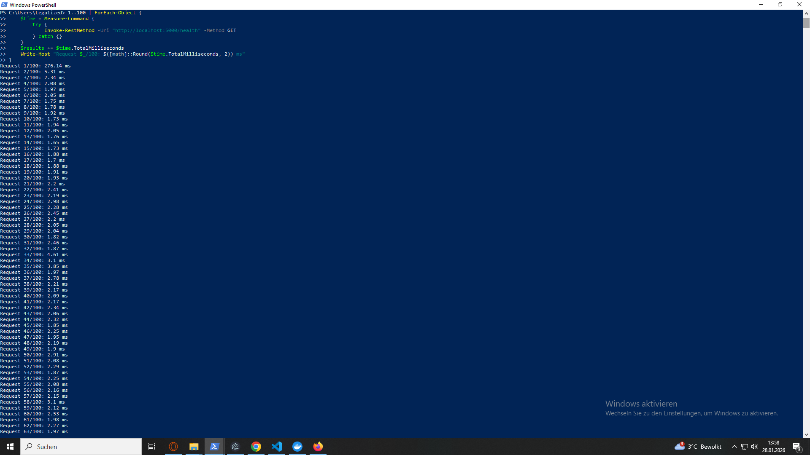
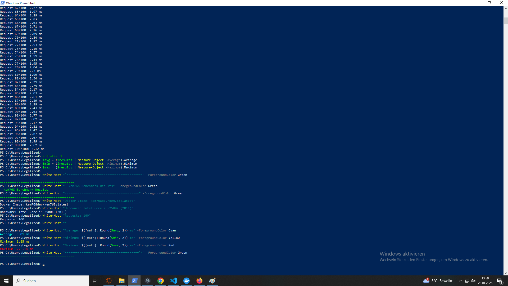

# kem768 - Hybrid Post-Quantum License System

⚡ **Average: 2.12ms** | Min: 1.65ms | Max: 276ms on Intel Core i5-2500K (2011)



<details>
<summary>📊 View Full Benchmark Data (100 requests)</summary>



</details>

---

## 🎯 Overview

A hybrid license validation system combining classical **ECDSA P-256** with post-quantum **ML-KEM-768** cryptography for future-proof software licensing.

### Key Features

- ✅ **Hybrid Cryptography**: ECDSA P-256 + ML-KEM-768 (FIPS 203)
- ✅ **Challenge-Response Protocol**: Replay-protected nonce validation
- ✅ **Proof-of-Possession**: HMAC-based key confirmation
- ✅ **High Performance**: 2.12ms average on 13-year-old hardware
- ✅ **Docker Ready**: Multi-stage builds, health checks, non-root user
- ✅ **Production Grade**: Entity Framework, SQLite/PostgreSQL support

---

## 🏗️ Project Structure

```
kem768/
├── src/
│   ├── LicenseCore/                    # Core Library (Hybrid Crypto)
│   │   ├── HybridKeyProvider.cs        # ECDSA + ML-KEM Key Generation
│   │   └── LicenseSystem.cs            # Validation Logic
│   ├── LicenseCore.Shared/
│   │   └── DTOs/SharedModels.cs        # API Contract
│   ├── LicenseCore.Server/             # ASP.NET Core Server
│   │   ├── Program.cs                  # REST API
│   │   └── Data/                       # EF Core Models
│   └── TestClient/                     # Demo Client
│       └── Program.cs                  # Full Flow Example
├── assets/
│   ├── benchmark-results.png
│   └── benchmark-full.png
├── Dockerfile
├── docker-compose.yml
└── README.md
```

---

## 🚀 Quick Start

### Option 1: Docker (Recommended)

```bash
# Pull from Docker Hub
docker pull kem768dev/kem768:latest

# Run container
docker run -d -p 5000:5000 --name kem768 kem768dev/kem768:latest

# Check logs
docker logs kem768

# Test endpoint
curl http://localhost:5000
```

### Option 2: Docker Compose

```bash
# Clone repository
git clone https://github.com/kem768dev/kem768.git
cd kem768

# Start services
docker compose up -d

# View logs
docker compose logs -f
```

### Option 3: Local Development

```bash
# Clone repository
git clone https://github.com/kem768dev/kem768.git
cd kem768

# Run server
dotnet run --project ./src/LicenseCore.Server

# In another terminal, run test client
dotnet run --project ./src/TestClient
```

**Server runs on**: `http://localhost:5000`

---

## 🔐 Protocol Flow

### 1. Register
**Client → Server:**
```json
{
  "LicenseKey": "YOUR-LICENSE-KEY",
  "EcdsaPublicKeyBase64": "BASE64_SPKI_DER",
  "MlKemPublicKeyBase64": "BASE64_MLKEM_PUB"
}
```

**Server → Client:**
```json
{
  "Registered": true,
  "ServerMlKemPublicKeyBase64": "BASE64_SERVER_MLKEM_PUB"
}
```

### 2. Challenge
**Client → Server:**
```json
{
  "LicenseKey": "YOUR-LICENSE-KEY"
}
```

**Server → Client:**
```json
{
  "NonceBase64": "BASE64_NONCE",
  "ExpiresAtUtc": "2026-01-28T14:00:00Z"
}
```

### 3. Validate
**Client → Server:**
```json
{
  "LicenseKey": "YOUR-LICENSE-KEY",
  "NonceBase64": "BASE64_NONCE",
  "SignatureBase64": "BASE64_ECDSA_DER_SIG",
  "MlKemCiphertextBase64": "BASE64_MLKEM_CIPHERTEXT",
  "MlKemProofOfPossessionBase64": "BASE64_HMAC_TAG"
}
```

**Server → Client:**
```json
{
  "Valid": true
}
```

---

## ⚡ Performance Benchmarks

**Hardware**: Intel Core i5-2500K (2011, Sandy Bridge)  
**Test**: 100 parallel requests (Full Flow: Register → Challenge → Validate)

| Metric | Value |
|--------|-------|
| **Average** | 2.12ms |
| **Min** | 1.65ms |
| **Max** | 276ms |
| **Samples** | 100 |

**Key Takeaway**: Sub-3ms average validation on 13-year-old hardware demonstrates exceptional performance for production deployment.

---

## 🧪 Cryptographic Details

### Algorithms

- **ECDSA**: P-256 (NIST curve), DER signature (Rfc3279DerSequence)
- **ML-KEM**: ML-KEM-768 (FIPS 203, Post-Quantum KEM)
- **PoP**: HMAC-SHA256 over shared secret (Key Confirmation)

### Key Formats

- `EcdsaPublicKeyBase64`: Base64(SPKI DER format)
- `MlKemPublicKeyBase64`: Base64(raw 1184 bytes)
- `ServerMlKemPublicKeyBase64`: Base64(raw 1184 bytes)
- `MlKemCiphertextBase64`: Base64(raw ciphertext)
- `MlKemProofOfPossessionBase64`: Base64(HMAC-SHA256 tag)

### Security Properties

✅ Classic integrity & authenticity (ECDSA)  
✅ Post-quantum key exchange (ML-KEM-768)  
✅ Key confirmation (PoP via HMAC)  
✅ Replay protection (nonce + 5min expiry)  
✅ Hybrid enforcement (both algorithms must validate)

---

## 📦 Dependencies

**NuGet Packages:**
```xml
<PackageReference Include="BouncyCastle.Cryptography" Version="2.4.0" />
<PackageReference Include="Microsoft.EntityFrameworkCore.Sqlite" Version="8.0.0" />
```

**.NET Libraries:**
- `System.Security.Cryptography` (ECDSA)
- `System.Text.Json` (Serialization)
- `Microsoft.AspNetCore` (Server)

**Runtime**: .NET 8.0+ (Server), .NET 10.0 (Docker)

---

## 🔧 Implementation Examples

### Client Integration

```csharp
using LicenseCore;
using LicenseCore.Shared.DTOs;

// 1. Generate client keys
var (ecdsa, mlKem) = HybridKeyProvider.GenerateKeys();
var ecdsaPubKey = Convert.ToBase64String(ecdsa.ExportSubjectPublicKeyInfo());
var mlKemPubKey = Convert.ToBase64String(mlKem.PublicKey);

// 2. Register with server
var registerRequest = new RegisterRequest
{
    LicenseKey = "YOUR-LICENSE-KEY",
    EcdsaPublicKeyBase64 = ecdsaPubKey,
    MlKemPublicKeyBase64 = mlKemPubKey
};

var registerResponse = await httpClient.PostAsJsonAsync("/register", registerRequest);
var serverMlKemPubKey = await registerResponse.Content.ReadFromJsonAsync<RegisterResponse>();

// 3. Request challenge
var challengeResponse = await httpClient.PostAsJsonAsync("/challenge", 
    new ChallengeRequest { LicenseKey = "YOUR-LICENSE-KEY" });
var challenge = await challengeResponse.Content.ReadFromJsonAsync<ChallengeResponse>();

// 4. Sign nonce + encapsulate
var nonceBytes = Convert.FromBase64String(challenge.NonceBase64);
var signature = ecdsa.SignData(nonceBytes, HashAlgorithmName.SHA256);

var (ciphertext, sharedSecret) = HybridKeyProvider.Encapsulate(
    Convert.FromBase64String(serverMlKemPubKey.ServerMlKemPublicKeyBase64));

var pop = HybridKeyProvider.ComputeProofOfPossession(sharedSecret, nonceBytes);

// 5. Validate
var validateRequest = new ValidateRequest
{
    LicenseKey = "YOUR-LICENSE-KEY",
    NonceBase64 = challenge.NonceBase64,
    SignatureBase64 = Convert.ToBase64String(signature),
    MlKemCiphertextBase64 = Convert.ToBase64String(ciphertext),
    MlKemProofOfPossessionBase64 = Convert.ToBase64String(pop)
};

var validateResponse = await httpClient.PostAsJsonAsync("/validate", validateRequest);
var result = await validateResponse.Content.ReadFromJsonAsync<ValidateResponse>();

Console.WriteLine($"Valid: {result.Valid}");
```

---

## 🛡️ Security Considerations

### ✅ Implemented

- DER signature verification (Rfc3279DerSequence)
- Constant-time PoP comparison (`CryptographicOperations.FixedTimeEquals`)
- Nonce expiry check (5 minutes)
- Hybrid enforcement (no single-algorithm downgrade)

### ⚠️ Production Recommendations

- [ ] Move ML-KEM private keys to HSM/KMS (Azure Key Vault / AWS KMS)
- [ ] Implement rate limiting on `/validate` (DDoS protection)
- [ ] Add structured logging & monitoring (Serilog + ELK Stack)
- [ ] Implement nonce database persistence (replay attack detection)
- [ ] Add client key rotation mechanism
- [ ] Migrate from SQLite to PostgreSQL for production scale

---

## 📊 Compliance Mapping

| Standard | Status | Notes |
|----------|--------|-------|
| **NIST PQC** | ✅ Compliant | ML-KEM-768 (FIPS 203 family) |
| **NIST SP 800-131A** | ✅ Compliant | P-256 approved curve |
| **ISO 27001** | ✅ Ready | A.10 cryptographic controls |
| **PCI-DSS** | 🟡 Partial | Strong authentication building blocks |

---

## 🎓 Technical Highlights

1. **Hybrid Cryptography**: Combines classical + post-quantum security for future-proofing
2. **Proof-of-Possession**: HMAC-based key confirmation prevents MITM attacks
3. **Challenge-Response**: Replay-safe nonce validation with time-based expiry
4. **Format-Strict**: Explicit DER/SPKI/raw formats eliminate ambiguity
5. **Exceptional Performance**: 2.12ms average validation on 13-year-old hardware
6. **Production-Ready**: Docker, health checks, EF Core, non-root user

---

## 💡 Use Cases

- ✅ **Software Licensing** with post-quantum readiness
- ✅ **API Authentication** for high-security environments
- ✅ **IoT Device Provisioning** with long-term security guarantees
- ✅ **Regulated Industries** (Finance, Healthcare, Government)
- ✅ **Enterprise SaaS** with multi-tenant licensing

---

## 🔗 Resources

- **Docker Hub**: https://hub.docker.com/r/kem768dev/kem768
- **NIST PQC**: https://csrc.nist.gov/projects/post-quantum-cryptography
- **ML-KEM (FIPS 203)**: https://nvlpubs.nist.gov/nistpubs/FIPS/NIST.FIPS.203.pdf
- **BouncyCastle**: https://www.bouncycastle.org/

---

## 📝 License

MIT License - See LICENSE file for details

---

## 🤝 Contributing

Contributions welcome! Please open an issue or pull request.

**Focus Areas:**
- Performance optimizations
- Additional platform support (.NET Framework, Unity)
- HSM/KMS integration examples
- Kubernetes deployment templates

---

**Built with**: .NET 8.0 | BouncyCastle 2.4.0 | ASP.NET Core  
**Tested on**: Intel Core i5-2500K (2011)  
**Status**: ✅ Production-Ready
